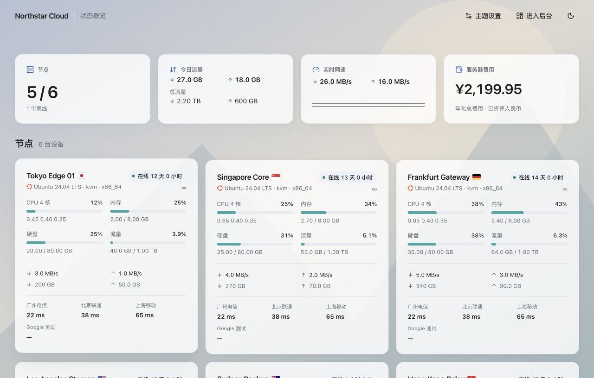

# Clarity

为 [monitor](https://github.com/monitor-probe/monitor) 设计的苹果风格公开状态页主题。界面简洁，支持明暗模式和四种节点视图。



## 功能

- 大卡片、小卡片、迷你卡片、列表四种视图
- 节点分组、详情、历史图表和实时数据
- 延迟监控：在节点卡片和列表展示后台分配的探测任务及最近结果
- 管理员可设置节点展示方式、顶部概览、费用统计方式、延迟开关、背景图片 API 和全局透明度；有分组时，访客可按分组浏览节点
- 纯色卡片与轻透顶栏；顶部费用卡可选择日均、月均或年化总费用
- 不覆盖站点原有 favicon

## 安装

1. 下载最新的 [theme.tar.gz](https://github.com/kure29/Monitor-Theme-Clarity/releases/latest/download/theme.tar.gz)。
2. 在 monitor 后台的「主题」页面上传并启用 **Clarity**。

管理员登录后，可在公开状态页右上角打开「主题设置」。此功能需要支持主题配置接口的 monitor 版本；旧版仍可使用默认界面。
已登录的管理员也可从公开页顶栏进入后台；访客不会看到此入口。

背景图片 API 地址应直接返回图片。主题会使用同一地址，并让图片自动填满手机与电脑屏幕；留空保留默认背景。请使用 HTTPS 地址（或本站路径），且不要在公开地址中包含私密密钥。

费用依据 monitor 后台填写的价格与付款周期计算。日均按年费用除以 365 天，月均为默认值，总费用按一年折算；这三个数值都是估算，不是历史实际支出。混合币种时，主题使用 [Frankfurter](https://frankfurter.dev/) 的参考汇率折算成人民币；汇率不可用时不显示不完整的总价。一次性购买不计入费用统计。

在 monitor 后台创建并分配 TCP 延迟探测任务后，主题会自动显示当前分配给每个节点的任务名称与结果。主题设置只需控制是否显示。迷你卡片和列表最多展示三项，其余显示数量。这里测量的是**节点到探测目标**的延迟；没有分配任务的节点不显示延迟区。

## 本地开发

```bash
npm ci
MONITOR_HUB=https://your-monitor.example.com npm run dev
```

运行 `npm run package` 可生成安装包 `theme.tar.gz`。

## 致谢与许可

基于 [monitor-theme-default](https://github.com/monitor-probe/monitor-theme-default) 的参考实现，多视图思路参考 [LuminaPlus](https://github.com/kure29/Monitor-Theme-LuminaPlus)。遵循 [MIT 许可](LICENSE)。
